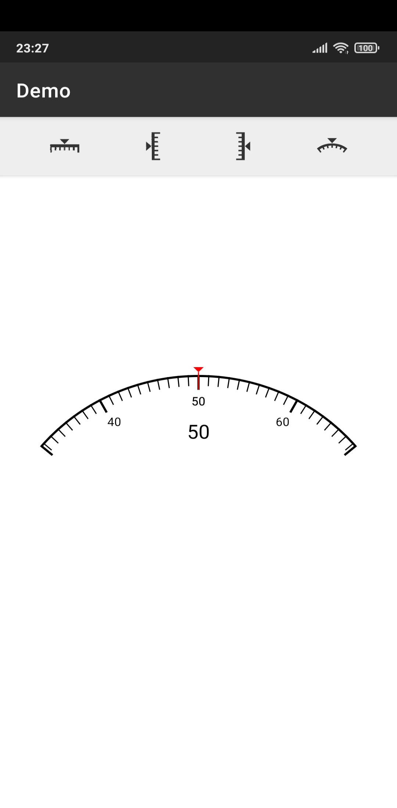
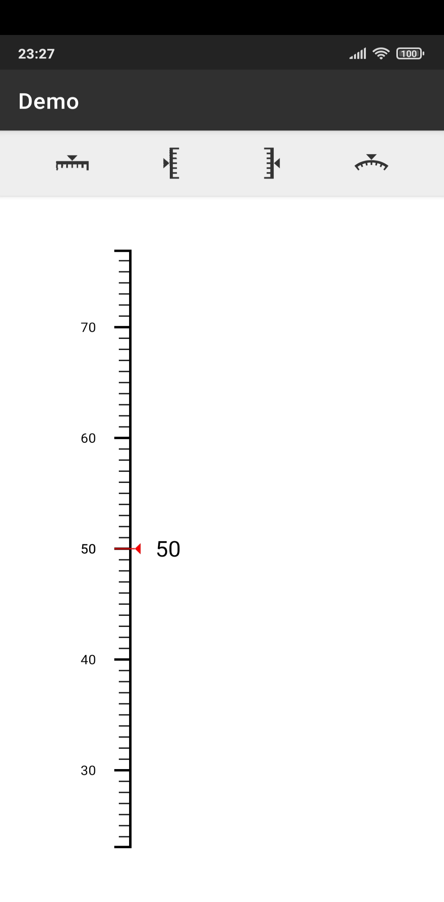
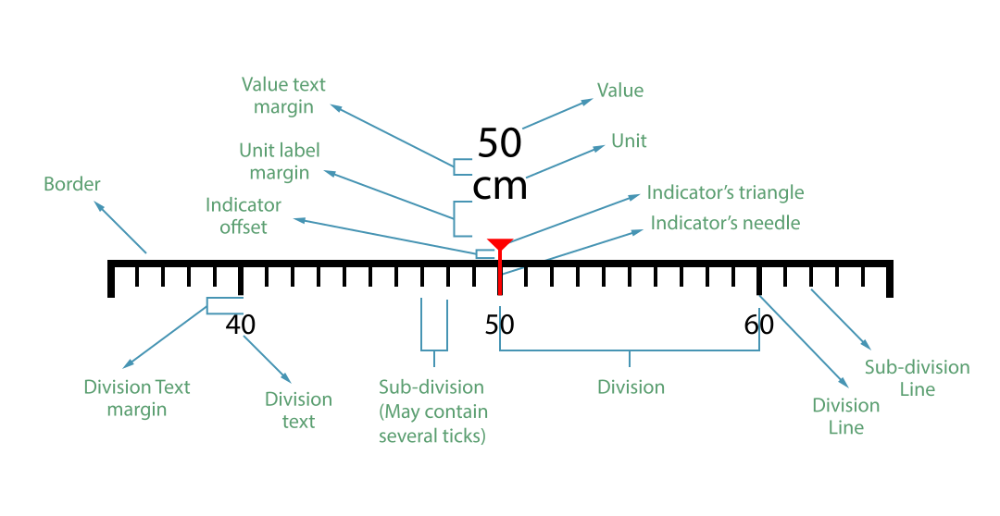

# ScaleNumberPicker

[](http://developer.android.com/index.html) [](http://www.oracle.com/technetwork/java/javase/downloads/index.html) [](https://android-arsenal.com/api?level=21) [](https://opensource.org/licenses/Apache-2.0)

The library is a custom number-picker for Android.

<kbd>
  <br/>
  <div align=center>
    
    
    
    
  </div>
  </br>
</kbd>

## Features
* Supports integers and decimal values.
* Supports units.
* Supports negative values.
* Has four different visual modes; horizontal, horizontal circular, vertical left and vertical right.
* Highly customizable. Fonts, colours, hight and width of border, dividers and indicator, and curve height.
* Supports using custom styles and themes.

## Labels
List of labels of the different elements in the ScaleNumberPicker.
<p align="center">
  
</p>

## Sub-Divisions and Ticks
* While Divisions are divided into Sub-divisions, Sub-divisions are also divided into smaller units called ticks.
* The scale snaps to the nearest tick after swiping in either direction.
* By default each division has 5 subdivisions and each subdivision has two ticks, these can be changed in the xml attributes however.
* To change the distace between subdivisions, the property `snp_subdivision_width` need to be adjusted.

## Usage
### Gradle
1. Add it in your root build.gradle at the end of repositories:
```groovy
allprojects {
    repositories {
        ...
        maven { url 'https://jitpack.io' }
    }
}
```

2. Add the dependency:
```groovy
dependencies {
    implementation 'com.github.arcm111.ScaleNumberPicker:final:1.0.1'
}
```
### Java
1. Set `ScaleNumberPicker.OnValueChangedListener` to listen to value changes:
```java
ScaleNumberPicker snp = findElementById("my-scale-numberpicker-id")
snp.setOnValueChangedListener(new ScaleNumberPicker.OnValueChangedListener(float oldValue, float newValue) {
    // Do something with the new value.
    ...
});
```

2. Get value programmatically:
```java
ScaleNumberPicker snp = findElementById("my-scale-numberpicker-id")
float value = snp.getValue();
```

3. Set value programmatically:
```java
ScaleNumberPicker snp = findElementById("my-scale-numberpicker-id")
float value = snp.setValue(myFloatValue);
```
### XML
```xml
<com.arcm.demo.ScaleNumberPicker
    android:id="@+id/scaleNumberPicker"
    android:layout_width="match_parent"
    android:layout_height="wrap_content"
    android:padding="40dp"
    app:snp_curve_height="72dp"
    app:snp_division_line_height="14dp"
    app:snp_division_text_margin="16dp"
    app:snp_indicator_offset="4dp"
    app:snp_indicator_triangle_width="10dp"
    app:snp_subdivision_line_height="10dp"
    app:snp_subdivisions_count_per_division="10"
    app:snp_tick_value="1"
    app:snp_ticks_count_per_subdivision="1"
    app:snp_unit_label_text_size="16sp"
    app:snp_value_text_margin="10dp"
    app:snp_value_text_size="20sp" />
```

## Attributes
Attribute Name | Description | Default Value
| --- | --- | --- |
snp_border_colour | Colour of the scale's border | #000000
snp_border_width | Line width of the scale's border | 2dp
snp_curve_height | The curve height of horizontal-circular scale type if already selected | 40dp
snp_division_line_height | Height of each division line | 16dp
snp_division_line_in_range_colour | Colour of in-range division lines | #000000
snp_division_line_out_of_range_colour | Colour of out-of-range division lines | #BBBBBB
snp_division_line_width | Width of each division line | 2dp
snp_division_text_colour | Colour of values located under each division line | #000000
snp_division_text_margin | Margin between division lines and division values | 12dp
snp_division_text_size | Text size of values located under each division line | 12sp
snp_indicator_colour | Colour of the indicator | #FF0000
snp_indicator_offset | Distance between the indicator's triangle and the border | 2dp
snp_indicator_triangle_width | Width of the indicator's needle | 8dp
snp_max_value | Maximum value in the scale | 100
snp_min_value | Minimum value in the scale | 0
snp_orientation | Orientation of the scale (Horizontal, VerticalLeft, VerticalRight, HorizontalCircular) | Horizontal
snp_show_indicator_needle | Show or hide the indicator's needle | true
snp_subdivision_line_height | Height of each subdivision line | 10dp
snp_subdivision_line_in_range_colour | Colour of in-range subdivision lines | #000000
snp_subdivision_line_out_of_range_colour | Colour of out-of-range subdivision lines | #BBBBBB
snp_subdivision_line_width | Width of each subdivision line | 1dp
snp_subdivision_width | Width of each subdivision | 10dp
snp_subdivisions_count_per_division | Number of subdivisions in each division | 5
snp_tick_value | Value of a single tick within a subdivision | 1
snp_ticks_count_per_subdivision | Number of ticks in each subdivision | 2
snp_unit_label | Unit label text to be displayed under the scale's selected value
snp_unit_label_margin | Margin between scale's value and its unit label | 2dp
snp_unit_label_text_colour | Colour of the unit label text | #000000
snp_unit_label_text_size | Text size of the unit label | 18sp
snp_value | Scale's currently selected value | 50
snp_value_text_colour | Colour of scale's selected value | 50 | #000000
snp_value_text_margin | Margin between Scale's selected value and indicator | 50 | 8dp
snp_value_text_size | Text size of the scale's selected value | 50 | 18sp


## License
The source code is licensed under the Apache 2.0 license.
